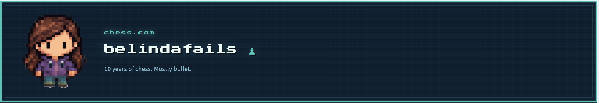

# Chess Dashboard

Personal project to build a Streamlit dashboard on 10 years of personal chess.com data.
Data Source: Chess.com API  



## Methodology

1. Download raw monthly game archives from Chess.com API  
2. Process raw JSON into cleaned tabular data  
3. Load processed data into the Streamlit dashboard for analysis  

## Files

- `app.py` - Streamlit dashboard  
- `data/processed/` - preprocessed dataset used by the app  
- `scripts/` - optional scripts to pull and process latest Chess.com data  

## How to Run

```bash
pip install -r requirements.txt
streamlit run app.py 
```

## Notes

- **My work:** project design, data ingestion from Chess.com API, data processing and analysis    
- **Claude help:** code iteration and UI
